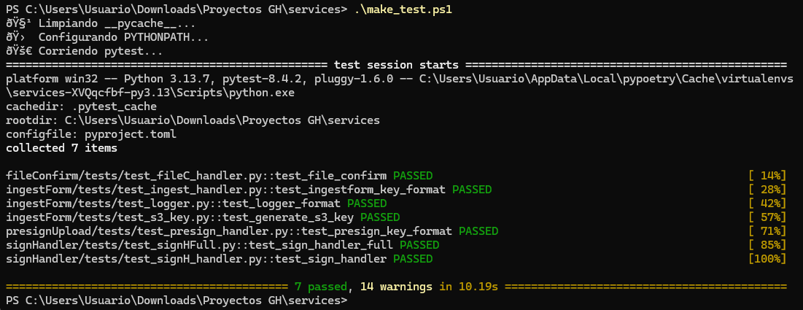

# Bitácora Técnica — Integración AWS ↔ Zoho (Semana 1 a Semana 2 Día 3)

**Autor:** Dylan Uribe  
**Proyecto:** CER - Integración AWS ↔ Zoho con IA y cumplimiento HIPAA  
**Periodo:** Semana 1 → Semana 2 Día 3  
**Estado:** En progreso (esperando conexión AWS)

---

## Resumen General

Durante estas dos semanas se construyó la base técnica del entorno de desarrollo que simula la integración completa entre **Zoho One (Forms, Flow, CRM)** y **AWS (API Gateway, Lambda, S3)**.

Aunque aún no se cuenta con la infraestructura real de AWS (S3, API Gateway), se implementó y probó un entorno **sandbox local**, con funciones Lambda simuladas, pruebas unitarias, documentación OpenAPI y ejecución mediante `pytest`.

El siguiente documento describe las actividades, configuraciones, evidencias y pendientes hasta el punto actual del desarrollo.

---

## Estructura del Proyecto
PS C:\Users\Usuario\Downloads\Proyectos GH\services> tree /F
Folder PATH listing for volume Acer
Volume serial number is E67F-7ECD
C:.
│   make_test.ps1
│   mock_server.py
│   poetry.lock
│   pyproject.toml
│   README dev-apply-steps.md
│   README.md
│
├───.pytest_cache
│   │   .gitignore
│   │   CACHEDIR.TAG
│   │   README.md
│   │
│   └───v
│       └───cache
│               lastfailed
│               nodeids
│
├───crmCallback
│       handler.py
│       README.md
│       __init__.py
│
├───docs
│       openapi v0.1.yaml
│       openapi v0.2.yaml
│       openapi v0.3.yaml
│       progress_log_week1-2.md
│
├───fileConfirm
│   │   handler.py
│   │   __init__.py
│   │
│   ├───tests
│   │   │   test_fileC_handler.py
│   │   │
│   │   └───__pycache__
│   │           test_fileC_handler.cpython-313-pytest-8.4.2.pyc
│   │
│   └───__pycache__
│           handler.cpython-313.pyc
│           __init__.cpython-313.pyc
│
├───ingestForm
│   │   handler.py
│   │   handlers.py
│   │   logger.py
│   │   README.md
│   │   s3_key.py
│   │   __init__.py
│   │
│   ├───sample_data
│   │       form.json
│   │
│   ├───tests
│   │   │   test_ingest_handler.py
│   │   │   test_logger.py
│   │   │   test_s3_key.py
│   │   │
│   │   └───__pycache__
│   │           test_ingest_handler.cpython-313-pytest-8.4.2.pyc
│   │           test_logger.cpython-313-pytest-8.4.2.pyc
│   │           test_s3_key.cpython-313-pytest-8.4.2.pyc
│   │
│   └───__pycache__
│           handler.cpython-313.pyc
│           logger.cpython-313.pyc
│           s3_key.cpython-313.pyc
│           __init__.cpython-313.pyc
│
├───presignUpload
│   │   handler.py
│   │   README.md
│   │   __init__.py
│   │
│   ├───tests
│   │   │   test_presign_handler.py
│   │   │
│   │   └───__pycache__
│   │           test_presign_handler.cpython-313-pytest-8.4.2.pyc
│   │
│   └───__pycache__
│           handler.cpython-313.pyc
│           __init__.cpython-313.pyc
│
└───signHandler
    │   handler.py
    │   README.md
    │   __init__.py
    │
    ├───tests
    │   │   test_signHFull.py
    │   │   test_signH_handler.py
    │   │
    │   └───__pycache__
    │           test_signHFull.cpython-313-pytest-8.4.2.pyc
    │           test_signH_handler.cpython-313-pytest-8.4.2.pyc
    │
    └───__pycache__
            handler.cpython-313.pyc
            __init__.cpython-313.pyc

## Entorno de Desarrollo

Lenguaje: Python 3.13
Gestor de dependencias: Poetry
Frameworks: Pytest, Boto3 (mock), FastAPI (para simulación), logging nativo
Archivo de configuración: pyproject.toml

Instalación local:
poetry install
poetry shell
pytest -v
python mock_server.py

| Lambda            | Descripción                                                                |
| ----------------- | -------------------------------------------------------------------------- | 
| **ingestForm**    | Recibe y valida datos de formularios Zoho. Crea la ruta `s3_key`simulada.  |
| **presignUpload** | Genera URLs firmadas para subida de archivos a S3.                         | 
| **fileConfirm**   | Confirma que los archivos fueron subidos correctamente.                    |
| **signHandler**   | Gestiona procesos de firma digital y verificación.                         |
| **crmCallback**   | Endpoint que recibe updates del CRM (estado del deal, firma, etc.).        | 

Cada módulo cuenta con su propio README.md explicando inputs, outputs y pruebas locales.

## Pruebas Unitarias

Se ejecutaron pruebas locales usando pytest sobre cada Lambda.

Comando:
pytest -v

## Documentación OpenAPI

Versionado dentro de /docs:

| Versión  | Descripción                               |
| -------- | ----------------------------------------- |
| **v0.1** | Endpoint inicial `/form/submit`           |
| **v0.2** | Agregado endpoint `/file/presign`         |
| **v0.3** | Añadido `/file/confirm` y `/crm/callback` |

Se usa formato OpenAPI 3.0 para especificar integración futura con API Gateway.

## Actividades Realizadas (Semana 1 → Semana 2 Día 3)
# Semana 1

Instalación y configuración del entorno local (Poetry, pytest, estructura base).

Creación de carpetas para cada Lambda.

Documentación inicial (README.md por módulo).

Implementación de mock_server.py para pruebas locales.

Primera versión de openapi v0.1.yaml.

# Semana 2

Añadidas Lambdas fileConfirm y signHandler.

Ampliación de pruebas unitarias.

Actualización de OpenAPI (v0.2 → v0.3).

Validación completa local (pytest passed).

Preparación de documentación técnica y screenshots.

## Pendientes (dependientes de AWS)

| Tarea                                      | Responsable   | Estado        |
| ------------------------------------------ | ------------- | ------------- |
| Crear bucket S3 y configurar políticas IAM | Ángel         | ⏳ Pendiente   |
| Configurar API Gateway y endpoints reales  | Ángel         | ⏳ Pendiente   |
| Entregar `dev API key` y URLs sandbox      | Ángel         | ⏳ Pendiente   |
| Validar conexión Zoho Flow → API Gateway   | Dylan         | ⏳ En espera   |
| Integrar seguridad HMAC + HTTPS            | Dylan & Ángel | ⏳ Planificado |

## Mis Próximos Pasos

Conectar Flow sandbox → endpoints locales para pruebas E2E.

Ajustar payloads Zoho Forms para coincidencia con ingestForm.

Crear guía “How to Deploy to AWS (Infra Setup)” cuando Ángel entregue claves.